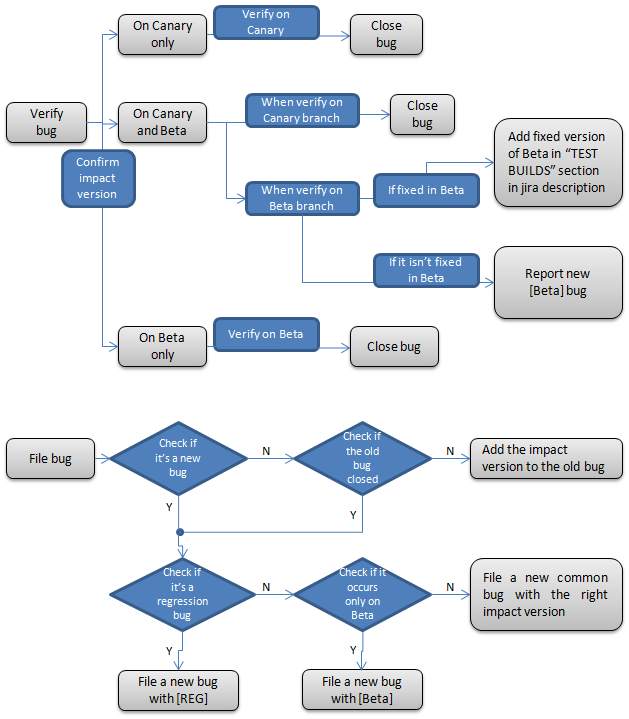

Issue tracking for Crosswalk using [JIRA](https://crosswalk-project.org/jira/). 

## Introduction

This document summarizes rules and best practices of writing bug reports, aiming
to serve as comprehensive guidelines that can guide engineers to write qualified
bug reports, thus enhancing the bug fixing efficiency.

> These are guidelines to make it easier for us to work on the bug report and reduce the effort, cost and time taken to actually fix it. However, if you have difficulty finding the information mentioned here, please *do* file a bug anyway since we can work with you to find out the missing information and fill it in later on.

## Background

Developers receive unqualified bug reports all the time, typical cases are shown 
below:

* Reports that say nothing ("It doesn't work!")
* Reports that make no sense
* Reports that don't give enough information
* Reports that give wrong information
* Reports of problems that turn out to be user error
* Reports of problems that turn out to be the fault of somebody else's program
* Reports of problems that turn out to be network failures

In a nutshell, the aim of a bug report is to make the content clear, helpful,
informative to enable developers to see the program failing in front of them by 
giving them careful and detailed instructions on how 
to make it fail, so that the corresponding bug can be fixed as soon as possible. 

## Short Checklist before Getting Started

* Can you reproduce the bug? Try to reproduce the bug by using the latest version of the software to see whether it has been fixed.
* Has someone else already reported the bug? If you encounter a problem or desire a new feature, there is a high probability that someone else already had this problem or idea. If so, an appropriate bug report may already exist. In this case, do not create a duplicate report. Try to search the bug in bug tracking system to see if it has been reported.    

## Quick Recommendations for Bug Reports
* Be precise: A good summary should be straightforward and precise to help identify the issue. 
* Be clear: Explain how to reproduce the problem step by step, so that others can reproduce the bug.
* Just state what you see. The issue is not the expected result.
** Specific function/feature not working: Prefer phrase "xxx not working", "unable to", "doesn't", "fails" to describe issues. Let's avoid using "can", "cannot" or "can't" in bug reports. This is important for others(especially native speakers) to understand the bugs easier.
** The result is not expected: Just state what you see. e.g. "Black screen during playing h.264 video"
** Issues not 100% reproducible: "...may...", "...sometimes..."
** Issues only occur under certain circumstances: "...when...", "...after..." 
* Tag "[REG]" should be added in summary for regression bugs. Provide regression points in bug descriptions.
* Tag "[BETA]" should be added in summary if bugs occur only on beta releases.

## Key Focuses for Opening a Bug 

This section describes key focuses for opening a bug.

### Components

Refer to [Crosswalk Components](https://crosswalk-project.org/jira/browse/XWALK#selectedTab=com.atlassian.jira.plugin.system.project%3Acomponents-panel)

### Priority
Refer to [Crosswalk bug and feature tracking and triaging] (https://crosswalk-project.org/#wiki/Crosswalk-bug-and-feature-tracking-and-triaging)

### Severity 
Refer to [Crosswalk bug and feature tracking and triaging] (https://crosswalk-project.org/#wiki/Crosswalk-bug-and-feature-tracking-and-triaging)

### OS 

This field indicates the OS on which the bug occurs. It helps developers to assign bugs and collect the summary of bugs info. Crosswalk QA doesn't recommend to report one bug with OS "All" but separate bugs with different OS even for common issue since some of them may need different teams support.

Valid values are as follows:
* All
* Windows
* Linux 
* Tizen --- Tizen Notebook, Tizen tablet and handset, IVI machine, IVI Emulator
* Android --- Android tablet and handset
* MacOS

### Platform/s
This field indicates the platform(s) on which the bug is detected. Be sure to select the proper platform before submitting a new bug. If you are not sure whether it can be reproduced on other platforms, just select the platform the issue was found. 

Valid values are as follows:
* Tablet IA
* Tablet ARM
* Desktop
* Handset IA
* Handset ARM
* Tizen Emulator
* IVI

### Affects Version/s

Version field indicates the version of software the bug is found. 

Valid values are as follows:
* Canary
* Beta
* Stable branches in each milestone

### Fix Version/s

Version field indicates the version of software the bug will be fixed. Usually this field should be filled by developer.

### Environment

For example operating system, software platform and/or hardware specifications (include as appropriate for the issue).

### Bug Description

  IMPACTED BUILDS AND CASES:
  
    List the impacted test images, builds and cases resources here.
    || Type || URL || 
    | System Image| https://address/to/image | 
    | Crosswalk Build| https://address/to/crosswalk/build | 
    | Test Suite/Case | http://address/to/test/suite/case | 

  REPRODUCE TEST STEPS:
  
    List the exact steps to reproduce the bug (bash commands, results after executing the commands etc., instead of only paraphrasing).
    Identify the simplest steps needed to reproduce the bug. This means we need to do more investigation to achieve this, and this is also the process to root cause the bugs. You need the make sure every step is required to reproduce the bug.

  EXPECTED RESULTS:
  
    Elaborate what's the expected behavior. 
    E.g. It should display green color after user click the "test" button;
         xxx method works well; 
         Got return value xxx;

  ACTUAL RESULTS:
  
    Write the actual outcome you got.
    e.g. xxx method throw a exception of ...
         Method got return value of yyy but not xxx.
         See red color on screen...

  TEST BUILDS:
  
    Include Version, Test Date, Test Device and Result. Edit TEST BUILDS every time after you tested.
    Format is:
      ||Version||Test Date|| Test Device || Result ||

  ATTACHMENTS：
  
    In [https://crosswalk-project.org/jira/browse/XWALK Crosswalk JIRA], it's better to provide attachments or screenshots in attachment when you filed a bug for developer to understand the bugs easier.

  ISSUE ANALYSIS：
  
    1. Usually you can paste the error message here.
    2. For system error like crash, provide the core backtrace log from logcat/dlogutil.
    3. Visual case failure, we could attach the screenshot for the failure phenomenon and pass screenshot in "Attachment" field.
    4. Attach the full error message if it is long.
    Reference of using logcat/dlogutil:
      1). For Android
           a. adb logcat -c (clear the entire log and exit);
           b. adb logcat | tee filename.log
      2). For Tizen
           a. dlogctrl set platform 1
           b. reboot
           c. dlogutil | tee filename.log

* Reproduce possibility. For bugs which are not 100% reproducible, please provide the possible steps to reproduce and an estimate of the probability of reproduction. Currently it is listed as percentage, it's better to give detailed output to demonstrate different level reliability. For example, 2 out of 5, or 4 out of 10.
* If the issue description is complex, provide examples to better illustrate it.
* Impact to system or user. Provide the description of the impact to the user or system. It's very important for developers and bug triage team to understand the issue and assign a proper priority.
* Usually please file bugs when: 
:* Relevant [https://crosswalk-project.org/jira/issues/?filter=10215 Crosswalk feature] has been "resolved" in JIRA in target milestone
:* When there are regression issues
:* Obvious lower pass rate or performance compared with upstream (Chrome) or reference (Webview, Cordova) results
* Review the description to make sure it's correct and no typo errors before submitting.

### Bug Description Example

  BUG SUMMARY:
  
    Crosswalk doesn't support dom event objects

  IMPACTED BUILDS AND CASES:
  
    || Type || URL || 
    | System Image| https://address/to/image | 
    | Crosswalk Build| https://download.01.org/crosswalk/releases/android-x86/beta/crosswalk-4.32.76.3-x86.zip | 
    | Test Suite | http://w3c-test.org/web-platform-tests/master/dom/events/Event-constants.html | 

  REPRODUCE TEST STEPS:
  
    1. Download "crosswalk-4.32.76.3-x86.zip" from https://download.01.org/crosswalk/releases/android-x86/canary/
    2. Unzip "crosswalk-4.32.76.3-x86.zip" and then unzip "xwalk_app_template.tar.gz".
    3. python make_apk.py --package=org.xwalk.domeventtests --name=domeventtests --app-url=http://w3c-test.org/web-platform-tests/master/dom/events/Event-constants.html --mode=embedded
    4. Install "domeventtests_x86.apk" to device.
    5. Make sure the device connects to network via 2g/3g or WIFI.
    6. Run this app.

  EXPECTED RESULTS:
  
    It should display PASS for four dom event objects.

  ACTUAL RESULTS:
  
    It displays "FAIL" for four dom event objects.

  TEST BUILDS:
  
      ||Version||Test Date|| Test Device || Result ||
      | 4.32.76.3-x86 | 02.19.2013 | ZTE Geek V985 | {color:red}FAIL{color}|

  ISSUE ANALYSIS：
  
    document.createEvent("Event") doesn't work on Crosswalk.
    More logs or conclusions should be included for the specific bugs you found.

  ATTACHMENTS：
  
    Attach screenshots or attachments.

## Bug Submission and Verification Workflow

## Bug verification criteria for beta branch
Branch point is important for QA to verify bugs on beta branch, e.g. branch crosswalk-4 beta build from canary 4.32.67.0:
* All the fixes in canary 4.32.67.0 will be included in crosswalk-4 beta, no need to double verify fixed canary bugs before 4.32.67.0 on crosswalk-4 beta builds.
* If the beta bugs were fixed later than canary 4.32.67.0, QA must double verify the bug on crosswalk-4 beta builds, file bugs with "[Beta]" tag if it's reproducible.
 