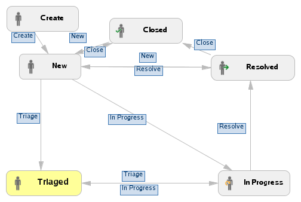
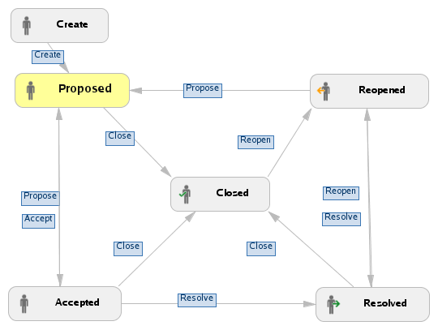
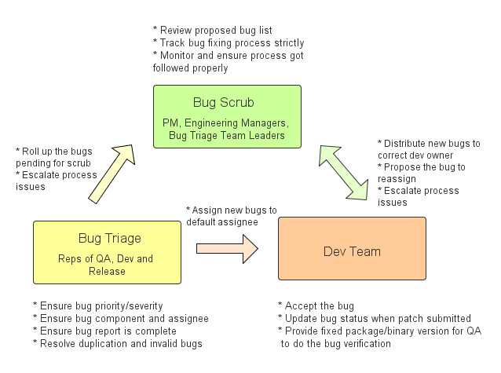

Issue tracking for Crosswalk using [JIRA](https://crosswalk-project.org/jira/). 

## Bug Workflow 

* New: The issue is newly reported or the resolved issue could be reopened by any user if still reproduced
* Triaged: The issue is triaged and ready for the default assigner to start work on it
* In Progress: The issue is being accepted and actively worked on at the moment by assigner
* Resolved: The issue has been fixed with the fixing patch submitted and integrated, or resolved by some other means (e.g. as a duplicate)
* Closed: The new issue is closed by triage team or the resolved bug is verified and closed by QA.

## Feature Workflow 

* Proposed: Features are proposed and reported. Every one can propose new features
* Accepted: Features are reviewed, owner is identified and the milestone target is committed
* Resolved: Features are implemented by engineering teams and available in a canary release, or resolved by some other mean (e.g. as a duplicate)
* Closed: Features are verified and no critical issues are identified, or they are rejected by the planning team. For some features that can not be verified by QA, they should be closed by triage team.
* Reopened: Features are not properly implemented and reopened by QA 

Cross-platform features have a top-level feature in Jira, and platform-specific features assigned to the relevant components. For example (see picture below), a W3C API "cool API" to be supported on Android and Tizen will have a top level feature "Cool API" assigned to the W3C API component, and will be blocked by two features, "[Android]
Cool API" in the "Crosswalk on Android" component, and "[Tizen] Cool API" in the "Crosswalk on Tizen" component.

## [Bug Components](https://crosswalk-project.org/jira/browse/XWALK#selectedTab=com.atlassian.jira.plugin.system.project%3Acomponents-panel) 

See [Jira] (https://crosswalk-project.org/jira/browse/XWALK#selectedTab=com.atlassian.jira.plugin.system.project%3Acomponents-panel)

## Bug Fields 
 
### Bug Priority Definition

Priority field describes the importance and order in which a bug should be fixed. It helps developers to prioritize their work. The priority got to be set as "Undecided" when reporting a new bug. Do NOT set bug priority in bug reporting. Bug priority would be set by bug triage team for each product.

* P1 --- Resolution of this defect takes precedence over other defects and most other development activities. This level is used to focus maximum team resources to resolve a defect in the shortest possible timeframe. The timeframe to resolve P1 priority defects is always immediate.
* P2 --- Resolution of the defect has precedence over resolving other defects with lesser classifications of priority. P2 priority defects are intended to be resolved by the next planned external release of the software.
* P3 --- Resolution of the defect has precedence over resolving other defects with lesser classifications of priority. P3 priority defects must have a planned timeframe for a verified resolution.
* P4 --- Resolution of the defect has the least urgency to resolve. P4 priority defects may or may not have documented plans to resolve. 

The priority of dependency bugs should be consistent with current bug.

### Bug Severity Definition

Severity field describes the impact of a bug. QA/bug reporter should review and adjust the bug severity from the whole product perspective.

* Critical --- Crashes, loss of data, negative impact to other components, memory leak etc
* Major --- Major loss of functionality
* Normal --- Regular issue, some loss of functionality under certain circumstance
* Minor --- Minor loss of functionality, or issues with easy workaround available 

## Bug Triage Process

## Bug Triage Definition

Bug Triage is a process to:

* Ensure bugs are set with proper Priority/Severity
* Ensure bug is reported with complete information for people to understand what the issue is
* Resolve Invalid and Duplicate bugs.
* Ensure enough log and debug info is provided for further diagnose, root cause and fix the bugs
* Isolate bugs to components with 90% confidence
* Isolate bugs to packages with 60% confidence if supporting packages 

## Bug Triage Team 
A team work on bug triage is expected to be comprised of PM, QA rep(s), dev rep(s) as mandatory team members, and distro rep(s) in some cases based on expertise mapping.
* Bug triage team roll up the bug list to bug scrub meeting.
* PM host weekly bug triage meeting to resolve controversial bugs.
* Team members need to be equipped with required expertise of the projects or key components, and MUST commit to the triage work. 