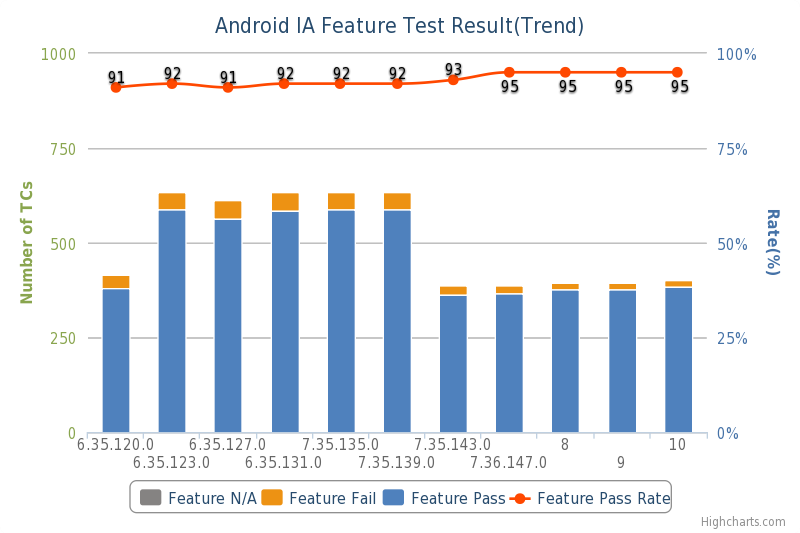
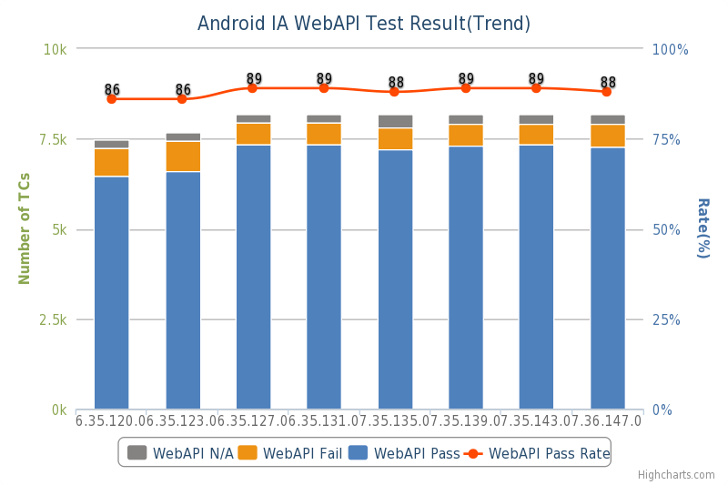
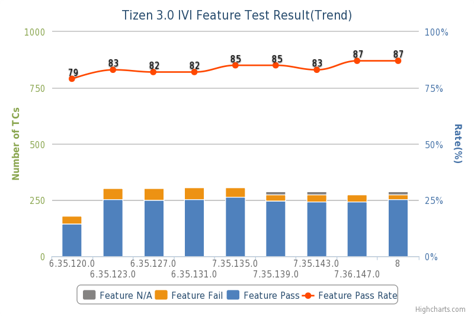
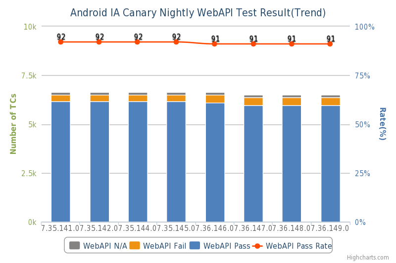
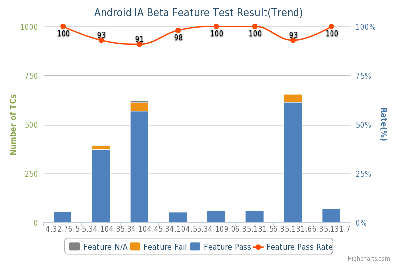
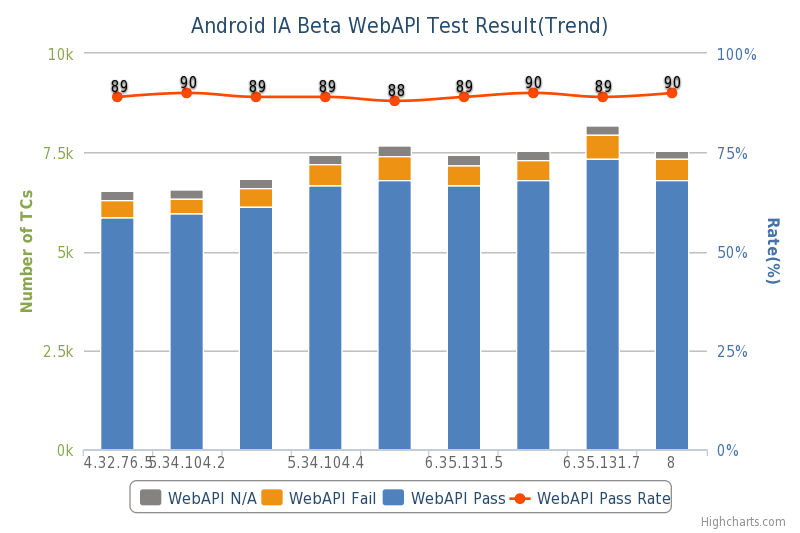
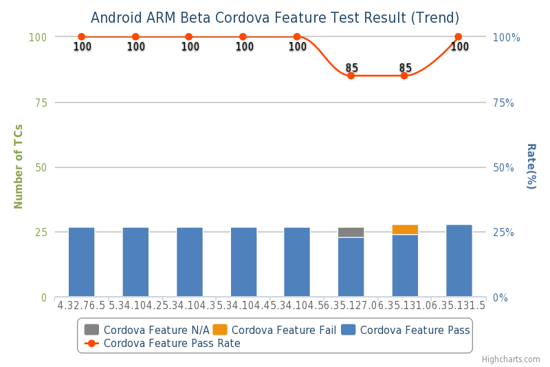

## Crosswalk test result indicators

Crosswalk QA follows [text execution plan](https://crosswalk-project.org/#wiki/Crosswalk-testing-home) to perform weekly and daily tests on Android and Tizen platforms, most of the test results are archived in [crosswalk-dev](https://lists.crosswalk-project.org/pipermail/crosswalk-dev/) mailing list. In this page, Crosswalk QA summarizes test indicators to present the overall test results of Crosswalk binaries.

## Canary indicators

### Crosswalk Full Test Result on Android IA

### Crosswalk Full Test Result on Tizen IVI

### Crosswalk BAT Test Result on Tizen Generic

### Crosswalk Nightly Test Result on Android IA 

### Cordova Canary Feature Test Result on Android ARM

## Beta indicators

### Crosswalk Regression Test Result on Android IA

### Crosswalk Regression Test Result on Android ARM

### Cordova Beta Regression Test Result on Android ARM

