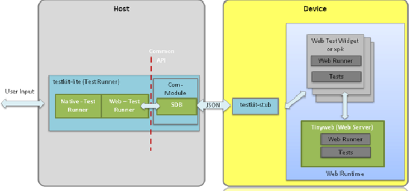
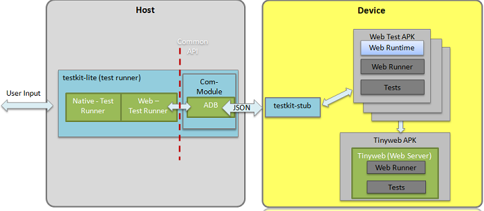

# Scope

Crosswalk Test Suite covers:
* Web API tests 
**Standard APIs Tests**: Test for Crosswalk supported W3C/HTML5 APIs and other popular APIs that are used widely, e.g. WebGL and Typed Arrays (Khronos Specifications), FullScreen API (Mozilla Specification), and viewport MetaTag (Apple Specification). 
**Experimental API tests**: Tests for Crosswalk supported additional experimental or emerging standards APIs besides the Standard APIs. e.g. Presentation API, Rawsocket API, DeviceCapabilities API. 
**Tizen Extension API tests**: Tests for Crosswalk supported extension for the Tizen APIs 
* Web Runtime and feature tests
* Behavior Tests
* Crosswalk Based Cordova Tests

# Test Approach

## Web API Tests

* Create one set of standard spec-based tests complying to API spec defined in [Crosswalk Web API features](https://crosswalk-project.org/jira/issues/?filter=10004), leveraging existing W3C etc upstream standard tests
* Integrate sample apps to evaluate the web API support capability of WRT from app perspective 

### Spec Based Web API Test

Spec-based Web API test suite is a set of specification-based and independent tests following [Crosswalk Web API features](https://crosswalk-project.org/jira/issues/?filter=10004). The test suite leverages and fills the gap of existing test cases created by standard organizations, for example, W3C and Khronos, who are the key Web API specification setters, and develop tests for Tizen new Web APIs. The test suite is automated extremely and independent of any Web runtime that complies with Tizen Web API specifications. 

To better present the test scope and coverage of Web API test cases, the level of specification coverage is defined as below:
* <u>Attribute & Method Coverage</u> - cover each attribute or method at least once by using normal values to ensure the presence of all defined attributes and methods
* <u>Parameter Coverage</u> - a superset of Attribute&Method coverage, which covers each parameter using minimum, maximum, normal, and error conditions of each range of values, parameter combination for the APIs with more than one parameter, and all return codes 
* <u>Statement Coverage</u> - a superset of parameter coverage, which covers testable statement, including common usage, error code (exceptions), code examples, and etc testable descriptive statements in each specification document

Attribute & Method Coverage <= Parameter Coverage <= Statement Coverage

The Crosswalk Web API specifications includes various types of docs to define JavaScript(JS) interfaces, HTML elements, CSS properties or other Misc usages. The following table describes the implication of specification coverage level for different specification types:

| Spec Type | Attribute & Method Coverage | Parameter Coverage | Statement Coverage
------------|-----------------------------|--------------------| --------------------
| JS relevant specs | attribute and method for each interface | values of attribute and parameters of method for each interface | testable statements described in spec doc
| HTML relevant specs | attribute and method for each element | values of attribute and parameters of method for each element | testable statements described in spec doc
| CSS relavent specs | property | values of property | testable statements described in spec doc
| Other specs (e.g. Widget) | Not applicable | Not applicable | testable statements described in spec doc

### Web API Sample Apps
* Leverage sample Web Apps to validate the web API support capability of web runtime from application perspective.

## Web Runtime and Feature Tests

* Create spec-based tests complying to web runtime related specifications and features
* Create additional implementation-based tests to full exercise the whole web runtime implementation on each vertical
* Create stability tests to ensure the run time robust

## Behavior Tests
* Behavior Test Tool is a standalone web application containing a bunch of use cases which need user manual execution. 
* Behavior Test Tool tests behavior of features in interactive mode.e.g. audio quality, touchscreen, accelerometer, camera, etc.

##  Crosswalk based Cordova Tests

[Cordova Android](https://github.com/apache/cordova-android) is an Android application library that allows for Cordova-based projects to be built for the Android Platform. Cordova based applications are, at the core, applications written with web technology: HTML, CSS and JavaScript. [Crosswalk based Cordova Android](https://crosswalk-project.org/#wiki/Crosswalk-cordova-android) aims to be compatible to Cordova Android as much as possible.

Crosswalk based Cordova Test includes:
* Cordova Mobile Spec Test leverages test cases from [Cordova Mobile Spec](https://github.com/apache/cordova-mobile-spec), a set of automated & manual tests that test Cordova core functionality.
* Web Runtime Test is to create spec-based tests complying to Cordova container related specifications and features.
* Web API Test on Crosswalk based Cordova covers all Web API test suites of Crosswalk on Android.

## Test Case Priority vs. Test Coverage
* P0 - use cases for feature to be tested, API use cases; P0 tests will be used in sanity testing
* P1 - feature verification tests, API and its attribute presence and normal usage; P0+P1 tests will be used in feature verification testing
* P2 - positive tests of extended feature tests, API parameter combination tests
* P3 - negative tests of extended feature tests, API spec descriptive statement tests, complicated use cases, stress tests; P0+P1+P2+P3 tests will be used in fullpass testing

# Web Test Code Repositories
* https://github.com/crosswalk-project/crosswalk-test-suite

# Test Execution
## Test Execution Framework

Testkit, the test execution framework of test suite, is an open source and common test execution framework for Linux, supporting both native testing and web testing. Crosswalk test suite uses following tools of testkit for execution.
* **Testkit-lite** is a command line test runner. It provides comprehensive options for testing in command line mode.
* **Testkit-stub** is a stub which will be deployed on devices, and running with testkit-lite   
* **Tinyweb** is a web server that runs on the device. It provides possible test resources (HTTP directory, CGI, WebSocket service) for web TCs.
     
* Testkit Home: https://github.com/testkit

## Test Execution Architecture
The crosswalk testing is using an automated testing execution framework that consists of two parts:
* Host: The **testkit-lite** runs on your desktop machine and manages test execution.
* Device: Individual test cases are executed on attached devices or on an emulator. **testkit-stub** is deployed on devices to provide communication between testkit-lite(Host) and test web-runner(Device).
** For the test cases depend on Web Service, a Local Web Server(**Tinyweb**) is set up on devices to support the testing. Test cases will be deployed on Local web server path, and executed from local Web Server side on device.
** For the test cases do not depend on Web Service, they will be executed directly on device.

### Test Arcthitecture on Tizen
On **Tizen Tareget Device**: The test cases are written in HTML, CSS and JavaScript and pack to .xpk, .wgt files to execute with test web-runner on the actual device target.   

### Test Architecture on Android
On **Android Target Device**: The test cases are written in HTML, CSS and JavaScript and pack to .apk files to execute with test web-runner on the actual device target.  
Different with Tizen platform, the test.apk files are packed as **Embedded mode** package: pack the test web App together with the related libarys (crosswalk runtime, Java wrapper). The apk file could be stored and executed without depending other APKs  

# Documents

## How to Run Crosswalk Web Test Suite

For Crosswalk Web testing for both automated and manual tests, please set up Crosswalk Test environment according to latest published User Guides.
* [WebAPI Test Suite User_Guide](https://github.com/crosswalk-project/crosswalk-test-suite/blob/master/doc/WebAPI_Test_Suite_User_Guide_v1.0.pdf)
* [Web Runtime Test Suite User Guide](https://github.com/crosswalk-project/crosswalk-test-suite/blob/master/doc/Web_Runtime_Test_Suite_User_Guide_v1.0.pdf)
* [Behavior Test Tool User Guide](https://github.com/crosswalk-project/crosswalk-test-suite/blob/master/doc/Behavior_Test_Tool_User_Guide_v1.0.pdf)
* [Cordova Test Suite User Guide](https://github.com/crosswalk-project/crosswalk-test-suite/blob/master/doc/Cordova_Test_Suite_User_Guide_v1.0.pdf)

## How to Contribute tests to Crosswalk Test Suite
Welcome to contribute new tests or bug fixings to existing tests, please follow the Test Developer Guides when contribute tests to Crosswalk Test Suite:
* [Web Test Suite Developer Guide](https://github.com/crosswalk-project/crosswalk-test-suite/blob/master/doc/WebAPI_Test_Suite_Developer_Guide_v1.0.docx)
* [Behavior Test Tool Developer Guide](https://github.com/crosswalk-project/crosswalk-test-suite/blob/master/doc/Behavior_Test_Tool_Developer_Guide_v1.0.docx) 
Please submit your changes Crosswalk_Test_Suite repo and your change will be reviewed shortly!
* [crosswalk-test-suite repository](https://github.com/crosswalk-project/crosswalk-test-suite)

# Bug Tracking
Test case bugs are tracked under Crosswalk JIRA: [Crosswalk Test Suite component](https://crosswalk-project.org/jira/browse/XWALK/component/10303)

# Support
For any question or support required, please send email to [crosswalk mailing list](http://lists.crosswalk-project.org/).